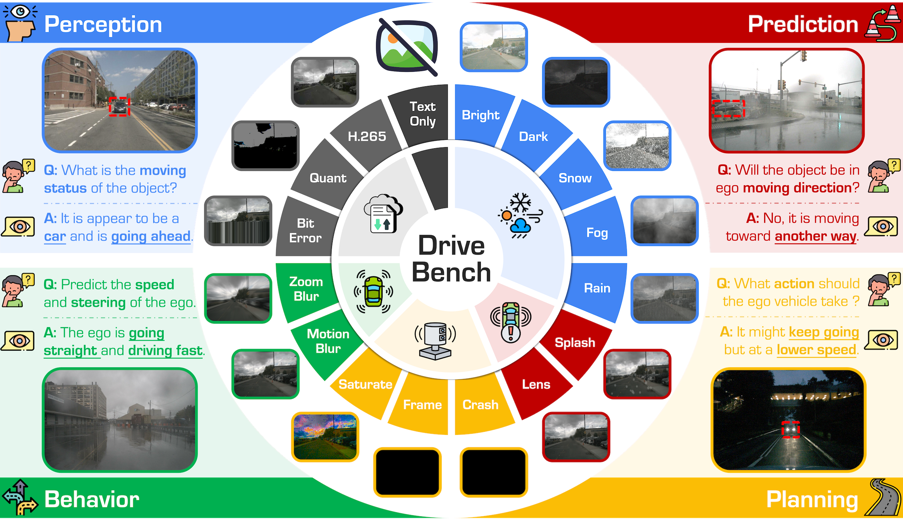
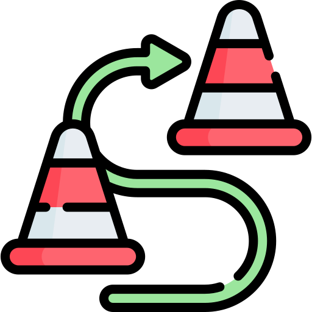
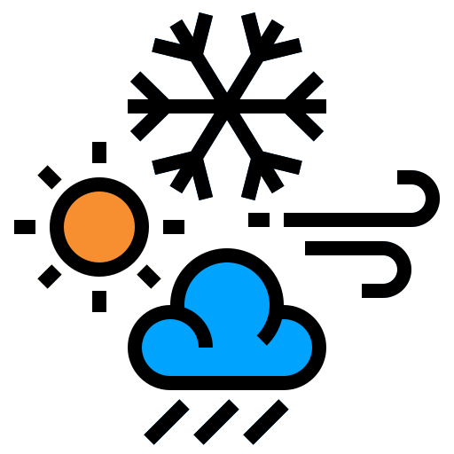
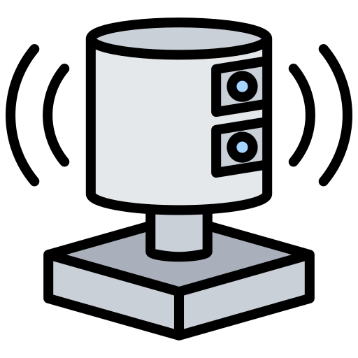
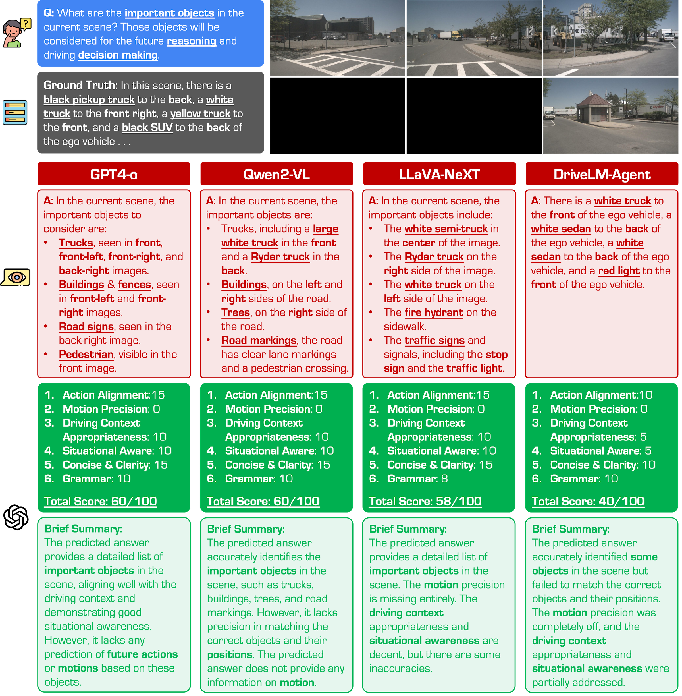
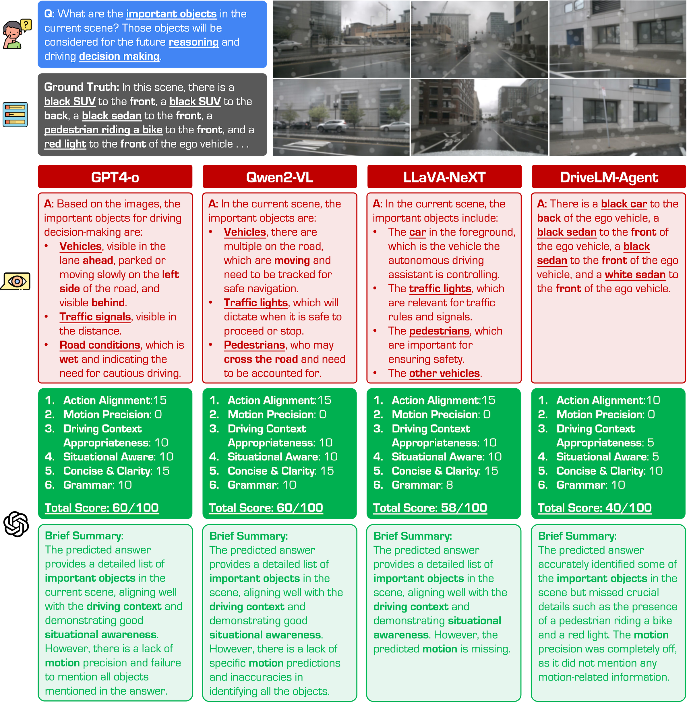

<p align="right">English | <a href="./README_CN.md">简体中文</a></div> 


<p align="center">
  <h2 align="center">  
    <strong>Are VLMs Ready for Autonomous Driving?<br>An Empirical Study from the Reliability, Data, and Metric Perspectives</strong>
  </h2>

  <p align="center">
      <a href="https://daniel-xsy.github.io/" target='_blank'>Shaoyuan Xie</a><sup>1</sup>&nbsp;&nbsp;&nbsp;&nbsp;
      <a href="https://ldkong.com/" target='_blank'>Lingdong Kong</a><sup>2,3</sup>&nbsp;&nbsp;&nbsp;&nbsp;
      <a href="https://scholar.google.com/citations?user=kMui170AAAAJJ&hl=en" target='_blank'>Yuhao Dong</a><sup>2,4</sup>&nbsp;&nbsp;&nbsp;&nbsp;
      <a href="https://scholar.google.com/citations?user=dgYJ6esAAAAJJ&hl=en" target='_blank'>Chonghao Sima</a><sup>2,5</sup><br>
      <a href="https://scholar.google.com/citations?user=QDXADSEAAAAJJ&hl=en" target='_blank'>Wenwei Zhang</a><sup>2</sup>&nbsp;&nbsp;&nbsp;&nbsp;
      <a href="https://ics.uci.edu/~alfchen/" target='_blank'>Qi Alfred Chen</a><sup>1</sup>&nbsp;&nbsp;&nbsp;&nbsp;
      <a href="https://liuziwei7.github.io/" target='_blank'>Ziwei Liu</a><sup>4</sup>&nbsp;&nbsp;&nbsp;&nbsp;
      <a href="https://scholar.google.com/citations?user=lSDISOcAAAAJJ&hl=en" target='_blank'>Liang Pan</a><sup>2</sup>
    </br></br>
  <sup>1</sup>UC Irvine&nbsp;&nbsp;&nbsp;
  <sup>2</sup>Shanghai AI Laboratory&nbsp;&nbsp;&nbsp;
  <sup>3</sup>NUS&nbsp;&nbsp;&nbsp;
  <sup>4</sup>NTU&nbsp;&nbsp;&nbsp;
  <sup>5</sup>HKU
  </p>
</p>

<p align="center">
  <a href="https://openaccess.thecvf.com/content/ICCV2025/html/Xie_Are_VLMs_Ready_for_Autonomous_Driving_An_Empirical_Study_from_ICCV_2025_paper.html" target='_blank'>
    
  </a>
  <a href="https://drive-bench.github.io/" target='_blank'>
    
  </a>
  <a href="https://huggingface.co/datasets/drive-bench/arena" target='_blank'>
    
  </a>
  <a >
    
  </a>
  <a href="https://github.com/drive-bench/toolkit" target="_blank">
    
  </a>
</p>


## About

|  |
|:-:|

- This work introduces :blue_car: **DriveBench**, a benchmark dataset designed to evaluate VLM reliability across **17 settings** (clean, corrupted, and text-only inputs), encompassing **19,200 frames**, **20,498 question-answer pairs**, **three question types**, **four mainstream driving tasks**, and **a total of 12 popular VLMs**. 
- Our findings reveal that VLMs often generate plausible responses derived from general knowledge or textual cues rather than true visual grounding, especially under degraded or missing visual inputs. This behavior, concealed by **dataset imbalances** and **insufficient evaluation metrics**, poses significant risks in safety-critical scenarios like autonomous driving. 

### :books: Citation
If you find this work helpful for your research, please kindly consider citing our papers:

```bibtex
@inproceedings{xie2025drivebench,
    title     = {Are {VLMs} Ready for Autonomous Driving? An Empirical Study from the Reliability, Data, and Metric Perspectives},
    author    = {Xie, Shaoyuan and Kong, Lingdong and Dong, Yuhao and Sima, Chonghao and Zhang, Wenwei and Chen, Qi Alfred and Liu, Ziwei and Pan, Liang},
    booktitle = {Proceedings of the IEEE/CVF International Conference on Computer Vision (ICCV)},
    pages     = {6585-6597},
    month     = {October},
    year      = {2025}
}
```
```bibtex
@misc{robosense_challenge_2025,
    title     = {The {RoboSense} Challenge: Sense Anything, Navigate Anywhere, Adapt Across Platforms},
    author    = {Kong, Lingdong and Xie, Shaoyuan and Gong, Zeying and Li, Ye and Chu, Meng and Liang, Ao and Dong, Yuhao and Hu, Tianshuai and Qiu, Ronghe and Li, Rong and Hu, Hanjiang and Lu, Dongyue and Yin, Wei and Ding, Wenhao and Li, Linfeng and Song, Hang and Zhang, Wenwei and Ma, Yuexin and Liang, Junwei and Zheng, Zhedong and Ng, Lai Xing and Cottereau, Benoit R. and Ooi, Wei Tsang and Liu, Ziwei and Zhang, Zhanpeng and Qiu, Weichao and Zhang, Wei and Ao, Ji and Zheng, Jiangpeng and Wang, Siyu and Yang, Guang and Zhang, Zihao and Zhong, Yu and Gao, Enzhu and Zheng, Xinhan and Wang, Xueting and Li, Shouming and Gao, Yunkai and Lan, Siming and Han, Mingfei and Hu, Xing and Malic, Dusan and Fruhwirth-Reisinger, Christian and Prutsch, Alexander and Lin, Wei and Schulter, Samuel and Possegger, Horst and Li, Linfeng and Zhao, Jian and Yang, Zepeng and Song, Yuhang and Lin, Bojun and Zhang, Tianle and Yuan, Yuchen and Zhang, Chi and Li, Xuelong and Kim, Youngseok and Hwang, Sihwan and Jeong, Hyeonjun and Wu, Aodi and Luo, Xubo and Xiao, Erjia and Zhang, Lingfeng and Tang, Yingbo and Cheng, Hao and Xu, Renjing and Ding, Wenbo and Zhou, Lei and Chen, Long and Ye, Hangjun and Hao, Xiaoshuai and Li, Shuangzhi and Shen, Junlong and Li, Xingyu and Ruan, Hao and Lin, Jinliang and Luo, Zhiming and Zang, Yu and Wang, Cheng and Wang, Hanshi and Gong, Xijie and Yang, Yixiang and Ma, Qianli and Zhang, Zhipeng and Shi, Wenxiang and Zhou, Jingmeng and Zeng, Weijun and Xu, Kexin and Zhang, Yuchen and Fu, Haoxiang and Hu, Ruibin and Ma, Yanbiao and Feng, Xiyan and Zhang, Wenbo and Zhang, Lu and Zhuge, Yunzhi and Lu, Huchuan and He, You and Yu, Seungjun and Park, Junsung and Lim, Youngsun and Shim, Hyunjung and Liang, Faduo and Wang, Zihang and Peng, Yiming and Zong, Guanyu and Li, Xu and Wang, Binghao and Wei, Hao and Ma, Yongxin and Shi, Yunke and Liu, Shuaipeng and Kong, Dong and Lin, Yongchun and Yang, Huitong and Lei, Liang and Li, Haoang and Zhang, Xinliang and Wang, Zhiyong and Wang, Xiaofeng and Fu, Yuxia and Luo, Yadan and Etchegaray, Djamahl and Li, Yang and Li, Congfei and Sun, Yuxiang and Zhu, Wenkai and Xu, Wang and Li, Linru and Liao, Longjie and Yan, Jun and Wang, Benwu and Ren, Xueliang and Yue, Xiaoyu and Zheng, Jixian and Wu, Jinfeng and Qin, Shurui and Cong, Wei and He, Yao},
    howpublished = {\url{https://robosense2025.github.io}},
    year      = {2025}
}
```


## :memo: Updates
- \[2025.07\] - The **DriveBench** dataset has been extended to **Track 1: Driving with Language** of the [RoboSense Challenge](https://robosense2025.github.io/) at [IROS 2025](https://www.iros25.org/). See the [track homepage](https://robosense2025.github.io/track1) and [GitHub repo](https://github.com/robosense2025/track1) for more details.
- \[2025.06\] - Our paper has been accepted to **ICCV 2025**. See you in Honolulu! 🌸
- \[2025.04\] - We are hosting the 2025 [RoboSense Challenge](https://robosense2025.github.io/)! Visit the [competition homepage](https://robosense2025.github.io/) for details and participation. :checkered_flag:
- \[2025.01\] - The evaluation data can be accessed at our [HuggingFace Dataset Card](https://huggingface.co/datasets/drive-bench/arena). :hugs:
- \[2025.01\] - Introducing the :blue_car: **DriveBench** project! For more details, kindly refer to our [Project Page](https://drive-bench.github.io/) and [Preprint](https://arxiv.org/abs/2501.04003). :rocket:


# Table of Contents
- [Benchmark Comparison](#bar_chart-benchmark-comparison)
- [Installation](#gear-installation)
- [Data Preparation](#hotsprings-data-preparation)
- [Getting Started](#rocket-getting-started)
- [Frame Recovery Experiments](#camera-frame-recovery-experiments)
  - [Overview](#overview)
  - [Prerequisites](#prerequisites)
  - [Step-by-Step Workflow](#step-by-step-workflow)
  - [Platform Guide](#platform-guide)
- [Benchmark Results](#aerial_tramway-benchmark-results)
  - [Benchmark Configuration](#benchmark-configuration)
  - [Benchmark Study](#benchmark-study)
  - [Robustness Analysis](#robustness-analysis)
- [License](#license)
- [Acknowledgments](#acknowledgments)


# :bar_chart: Benchmark Comparison

<table>
<thead>
<tr>
<th rowspan="2">Benchmark</th>
<th rowspan="2"><span>Perception</span></th>
<th rowspan="2"><span>Prediction</span></th>
<th rowspan="2"><span>Behavior</span></th>
<th rowspan="2"><span>Planning</span></th>
<th rowspan="2"><span>Robustness</span></th>
<th>Frames</th>
<th>QA</th>
<th rowspan="2">Logic</th>
<th rowspan="2">Evaluation Metrics</th>
</tr>
<tr>
<th>(Test)</th>
<th>(Test)</th>
</tr>
</thead>
<tbody>
<tr>
<td></td><td></td><td></td><td></td><td></td><td></td><td></td><td></td><td></td><td></td>
</tr>
<tr>
<td>BDD-X</td>
<td><span style="color: rgb(0, 176, 80);">✔</span></td>
<td><span style="color: rgb(192, 0, 0);">✘</span></td>
<td><span style="color: rgb(192, 0, 0);">✘</span></td>
<td><span style="color: rgb(192, 0, 0);">✘</span></td>
<td><span style="color: rgb(192, 0, 0);">✘</span></td>
<td>-</td>
<td>-</td>
<td>None</td>
<td>Language</td>
</tr>
<tr>
<td>BDD-OIA</td>
<td><span style="color: rgb(0, 176, 80);">✔</span></td>
<td><span style="color: rgb(192, 0, 0);">✘</span></td>
<td><span style="color: rgb(0, 176, 80);">✔</span></td>
<td><span style="color: rgb(192, 0, 0);">✘</span></td>
<td><span style="color: rgb(192, 0, 0);">✘</span></td>
<td>-</td>
<td>-</td>
<td>None</td>
<td>F1 Score</td>
</tr>
<tr>
<td>nuScenes-QA</td>
<td><span style="color: rgb(0, 176, 80);">✔</span></td>
<td><span style="color: rgb(192, 0, 0);">✘</span></td>
<td><span style="color: rgb(192, 0, 0);">✘</span></td>
<td><span style="color: rgb(192, 0, 0);">✘</span></td>
<td><span style="color: rgb(192, 0, 0);">✘</span></td>
<td>36,114</td>
<td>83,337</td>
<td>None</td>
<td>Acc</td>
</tr>
<tr>
<td>Talk2Car</td>
<td><span style="color: rgb(0, 176, 80);">✔</span></td>
<td><span style="color: rgb(192, 0, 0);">✘</span></td>
<td><span style="color: rgb(192, 0, 0);">✘</span></td>
<td><span style="color: rgb(0, 176, 80);">✔</span></td>
<td><span style="color: rgb(192, 0, 0);">✘</span></td>
<td>~1.8k</td>
<td>2,447</td>
<td>None</td>
<td>-</td>
</tr>
<tr>
<td>nuPrompt</td>
<td><span style="color: rgb(0, 176, 80);">✔</span></td>
<td><span style="color: rgb(192, 0, 0);">✘</span></td>
<td><span style="color: rgb(192, 0, 0);">✘</span></td>
<td><span style="color: rgb(192, 0, 0);">✘</span></td>
<td><span style="color: rgb(192, 0, 0);">✘</span></td>
<td>~36k</td>
<td>~6k</td>
<td>None</td>
<td>AMOTA</td>
</tr>
<tr>
<td>DRAMA</td>
<td><span style="color: rgb(0, 176, 80);">✔</span></td>
<td><span style="color: rgb(192, 0, 0);">✘</span></td>
<td><span style="color: rgb(192, 0, 0);">✘</span></td>
<td><span style="color: rgb(0, 176, 80);">✔</span></td>
<td><span style="color: rgb(192, 0, 0);">✘</span></td>
<td>-</td>
<td>~14k</td>
<td>Chain</td>
<td>Language</td>
</tr>
<tr>
<td>Rank2Tel</td>
<td><span style="color: rgb(0, 176, 80);">✔</span></td>
<td><span style="color: rgb(192, 0, 0);">✘</span></td>
<td><span style="color: rgb(192, 0, 0);">✘</span></td>
<td><span style="color: rgb(0, 176, 80);">✔</span></td>
<td><span style="color: rgb(192, 0, 0);">✘</span></td>
<td>-</td>
<td>-</td>
<td>Chain</td>
<td>Accuracy, Language</td>
</tr>
<tr>
<td>DirveMLLM</td>
<td><span style="color: rgb(0, 176, 80);">✔</span></td>
<td><span style="color: rgb(192, 0, 0);">✘</span></td>
<td><span style="color: rgb(192, 0, 0);">✘</span></td>
<td><span style="color: rgb(192, 0, 0);">✘</span></td>
<td><span style="color: rgb(192, 0, 0);">✘</span></td>
<td>880</td>
<td>-</td>
<td>None</td>
<td>Acc</td>
</tr>
<tr>
<td>DriveVLM</td>
<td><span style="color: rgb(0, 176, 80);">✔</span></td>
<td><span style="color: rgb(192, 0, 0);">✘</span></td>
<td><span style="color: rgb(0, 176, 80);">✔</span></td>
<td><span style="color: rgb(0, 176, 80);">✔</span></td>
<td><span style="color: rgb(192, 0, 0);">✘</span></td>
<td>-</td>
<td>-</td>
<td>None</td>
<td>GPT<sub>ctx</sub></td>
</tr>
<tr>
<td>DriveLM</td>
<td><span style="color: rgb(0, 176, 80);">✔</span></td>
<td><span style="color: rgb(0, 176, 80);">✔</span></td>
<td><span style="color: rgb(0, 176, 80);">✔</span></td>
<td><span style="color: rgb(0, 176, 80);">✔</span></td>
<td><span style="color: rgb(192, 0, 0);">✘</span></td>
<td>4,794</td>
<td>15,480</td>
<td>Graph</td>
<td>Language, GPT</td>
</tr>
<tr>
<td><strong><span style="font-family: 'Nunito', sans-serif; color: rgb(66, 133, 244);">Drive</span><span style="font-family: 'Nunito', sans-serif; color: rgb(192, 0, 0);">Bench</span> (Ours)</strong></td>
<td><span style="color: rgb(0, 176, 80);">✔</span></td>
<td><span style="color: rgb(0, 176, 80);">✔</span></td>
<td><span style="color: rgb(0, 176, 80);">✔</span></td>
<td><span style="color: rgb(0, 176, 80);">✔</span></td>
<td><span style="color: rgb(0, 176, 80);">✔</span></td>
<td><b>19,200</b></td>
<td><b>20,498</b></td>
<td><b>Graph</b></td>
<td><b>Acc, Language, GPT, GPT<sub>ctx</sub></b></td>
</tr>
</tbody>     
</table>


# :gear: Installation

For details related to installation and environment setups, kindly refer to [INSTALL.md](./docs/INSTALL.md).


# :hotsprings: Data Preparation

Kindly refer to [DATA_PREPAER.md](./docs/DATA_PREPAER.md) for the details to prepare the datasets.


# :rocket: Getting Started

To learn more usage about this codebase, kindly refer to [GET_STARTED.md](./docs/GET_STARTED.md).


# :camera: Frame Recovery Experiments

## Overview

This extension adds a **frame-recovery layer** on top of DriveBench to study how VLMs respond when lost camera frames are reconstructed from temporal neighbors instead of being left blank. Four recovery strategies are included:

| Strategy | Description | Real-time safe? |
|---|---|---|
| `previous` | Substitute the nearest past sweep | Yes |
| `nearest` | Substitute the closest sweep (past or future) | Buffered |
| `linear_blend` | Weighted PIL blend of the surrounding pair | Buffered |
| `rife` | RIFE learned interpolation (GPU optional) | No |

Six VLM test conditions are compared end-to-end:

| Condition | Image source | Flag needed |
|---|---|---|
| `clean` | Original DriveBench keyframes | — |
| `noimage` | Blank black placeholder | — |
| `previous` | `Recovered_Previous/` | — |
| `nearest` | `Recovered_Nearest/` | — |
| `linear_blend` | `Recovered_Linearblend/` | — |
| `rife` | `Recovered_RIFE/` (learned interpolation) | `--with-rife` |
| `lidar` | `Recovered_LiDAR/` (depth-colourised projection) | `--with-lidar` |

Image quality is validated independently (PSNR / SSIM / L1) so you can evaluate reconstruction fidelity without running any VLM.

---

## Prerequisites

### 1 — Install dependencies

```bash
# Core
pip install -r requirements.txt

# macOS (Apple Silicon) — MLX inference
pip install mlx-lm mlx-vlm

# Linux / WSL2 — vLLM inference
pip install vllm
```

### 2 — Download nuScenes data

Go to the [nuScenes download page](https://www.nuscenes.org/nuscenes) and download:

| Package | Size | Required for |
|---|---|---|
| `v1.0-trainval_meta.tgz` | ~0.43 GB | metadata (always needed) |
| `v1.0-trainval01_blobs.tgz` | ~26 GB | blobs 01 (first 18 keyframes — pilot) |
| Additional blobs 02–10 | ~28–38 GB each | full 200-frame coverage |

Extract into `data/nuscenes/` so the layout is:

```
data/nuscenes/
  v1.0-trainval_meta/
    v1.0-trainval/        ← scene.json, sample.json, …
  v1.0-trainval01_blobs/
    samples/              ← keyframe images
    sweeps/               ← sweep images (temporal neighbors)
```

> **Pilot run (macOS / fast test):** blob 01 alone covers 18 of the 200 DriveBench keyframes.  
> Use `--pilot` / `--limit 20` flags (described below) to test without all blobs.

---

## Step-by-Step Workflow

All numbered scripts in `script/` run the complete pipeline in order.  
Run them from the **repo root**.

### Step 0 — Set up RIFE (optional, GPU/MPS recommended)

RIFE requires a one-time clone of the model repo and manual weight download.  
Steps 1–4 work without RIFE; add `--with-rife` to any step to include it.

```bash
bash script/00_setup_rife.sh
```

If weights are missing, the script prints exact download instructions pointing to
[the RIFE model list](https://github.com/hzwer/ECCV2022-RIFE#model-list).  
Extract the HDv3 weights so that `recovery/rife/train_log/flownet.pkl` exists, then re-run to confirm.

> **Platform note:** On macOS (Apple Silicon) RIFE runs on MPS (float32 fallback).  
> On Linux/WSL2 it runs on CUDA. CPU fallback works but is very slow (~2 min/frame).

> **LiDAR note:** No model weights needed for `--with-lidar` — it is pure numpy + PIL.  
> It only requires the `sweeps/LIDAR_TOP/*.bin` files already present in your nuScenes blob.

### Step 1 — Build neighbor manifest + recovered images

```bash
# Full run (all available frames)
bash script/01_build_recovery.sh

# Quick pilot — first 20 frames only
bash script/01_build_recovery.sh --limit 20

# Include RIFE (requires Step 0 complete)
bash script/01_build_recovery.sh --with-rife
bash script/01_build_recovery.sh --limit 20 --with-rife

# Include LiDAR (no setup needed — requires sweeps/LIDAR_TOP/ in BLOB_DIR)
bash script/01_build_recovery.sh --with-lidar
bash script/01_build_recovery.sh --limit 20 --with-lidar

# Run everything at once
bash script/01_build_recovery.sh --limit 20 --with-rife --with-lidar
```

This script:
1. Runs `tools/fetch_nuscenes_temporal_neighbors.py` to copy sweep images alongside each keyframe.
2. Runs `recovery/temporal_recovery.py` for each strategy to produce:

```
data/corruption/
  Recovered_Previous/
  Recovered_Nearest/
  Recovered_LinearBlend/
  Recovered_RIFE/          ← only when --with-rife is passed
  Recovered_LiDAR/         ← only when --with-lidar is passed
```

### Step 2 — Validate image quality (no VLM needed)

```bash
bash script/02_validate_recovery.sh
```

Computes PSNR, SSIM, and L1 error for each recovery method vs. the original keyframes.  
Output: `data/recovery_validation.json`

Example pilot results (18 frames, blob 01):

| Method | PSNR (dB) | SSIM |
|---|---|---|
| `previous` | ~19.7 | ~0.67 |
| `nearest` | ~20.5 | ~0.69 |
| `linear_blend` | ~21.7 | ~0.72 |

### Step 3 — Run VLM inference

#### macOS (Apple Silicon — MLX)

```bash
# Full dataset, 5 conditions (clean / noimage / previous / nearest / linear_blend)
bash script/03_run_inference_mac.sh

# Pilot subset (18-frame blob-01 subset, ~102 questions)
bash script/03_run_inference_mac.sh --pilot

# Include RIFE as 6th condition (requires Recovered_RIFE/ from Step 1)
bash script/03_run_inference_mac.sh --pilot --with-rife

# Include LiDAR as 7th condition (requires Recovered_LiDAR/ from Step 1)
bash script/03_run_inference_mac.sh --pilot --with-lidar

# All conditions
bash script/03_run_inference_mac.sh --pilot --with-rife --with-lidar
```

Results are written to `output/` as JSON files, e.g.:

```
output/pilot_clean.json
output/pilot_previous.json
output/pilot_nearest.json
output/pilot_linearblen.json
output/pilot_noimage.json
```

> Inference is checkpointed (`.ckpt.jsonl` files).  
> If interrupted, re-running the same script resumes from the last completed question.

#### Linux / WSL2 (vLLM + CUDA)

```bash
# Full dataset
bash script/03_run_inference_linux.sh

# Pilot subset
bash script/03_run_inference_linux.sh --pilot

# Include RIFE as 6th condition
bash script/03_run_inference_linux.sh --pilot --with-rife

# Include LiDAR as 7th condition
bash script/03_run_inference_linux.sh --pilot --with-lidar

# All conditions
bash script/03_run_inference_linux.sh --pilot --with-rife --with-lidar
```

The script auto-detects WSL2 and adjusts GPU memory limits accordingly.

### Step 4 — Compare conditions

```bash
bash script/04_compare_conditions.sh --model qwen2.5-vl-7b-mlx

# Include RIFE and/or LiDAR in the comparison table
bash script/04_compare_conditions.sh --model qwen2.5-vl-7b-mlx --with-rife
bash script/04_compare_conditions.sh --model qwen2.5-vl-7b-mlx --with-lidar
bash script/04_compare_conditions.sh --model qwen2.5-vl-7b-mlx --with-rife --with-lidar
```

Prints a per-condition accuracy table with 95 % bootstrap confidence intervals on the delta vs. clean, and summarises image quality from Step 2.

Expected ordering:

```
clean > rife ≥ nearest > lidar > previous > noimage / FrameLost
```

> LiDAR PSNR will be lower than temporal methods (different modality), but VLM scores should exceed blank since depth maps carry spatial structure.

---

## Platform Guide

| Feature | macOS (Apple Silicon) | Linux / WSL2 |
|---|---|---|
| Inference backend | MLX (`mlx-community/Qwen2.5-VL-7B-Instruct-bf16`) | vLLM (`Qwen/Qwen2.5-VL-7B-Instruct`) |
| Inference script | `script/03_run_inference_mac.sh` | `script/03_run_inference_linux.sh` |
| Env file sourced | `env.sh` | `env.linux.sh` |
| Recovery scripts | `script/01_build_recovery.sh` | same |
| Validation script | `script/02_validate_recovery.sh` | same |
| RIFE support | MPS (float32 fallback) | CUDA |
| Pilot mode flag | `--pilot` | `--pilot` |

> All recovery-building and validation steps are pure Python / PIL and work identically on both platforms (no GPU required).

---

For more details on the recovery implementations, see [`recovery/temporal_recovery.py`](./recovery/temporal_recovery.py) and the individual tool scripts in [`tools/`](./tools/).


# :aerial_tramway: Benchmark Results

## Benchmark Configuration

<details open>
<summary>&nbsp<b>Commercial VLMs</b></summary>
  
> - [x] **[GPT4-o]()**

</details>

<details open>
<summary>&nbsp<b>Open-Source VLMs</b></summary>
  
> - [x] **[LLaVA-1.5]()** <sup>[**`[Code]`**]()</sup>
> - [x] **[LLaVA-NeXT]()** <sup>[**`[Code]`**]()</sup>
> - [x] **[InternVL2]()** <sup>[**`[Code]`**]()</sup>
> - [x] **[Phi-3]()** <sup>[**`[Code]`**]()</sup>
> - [x] **[Phi-3.5]()** <sup>[**`[Code]`**]()</sup>
> - [x] **[Oryx]()** <sup>[**`[Code]`**]()</sup>
> - [x] **[Qwen2-VL]()** <sup>[**`[Code]`**]()</sup>

</details>

<details open>
<summary>&nbsp<b>Specialist VLMs</b></summary>
  
> - [x] **[DriveLM-Agent]()** <sup>[**`[Code]`**]()</sup>
> - [x] **[Dolphins]()** <sup>[**`[Code]`**]()</sup>

</details>


## Benchmark Study

<table>
<thead>
<tr>
<th>Model</th>
<th>Size</th>
<th>Type</th>
<th><span>Perception</span> (<span style="color: rgb(0, 176, 80);">Clean</span>)</th>
<th><span>Perception</span> (<span style="color: rgb(192, 0, 0);">Corr.</span>)</th>
<th><span>Perception</span> (<span style="color: rgb(66, 133, 244);">T.O.</span>)</th>
<th><span>Prediction</span> (<span style="color: rgb(0, 176, 80);">Clean</span>)</th>
<th><span>Prediction</span> (<span style="color: rgb(192, 0, 0);">Corr.</span>)</th>
<th><span>Prediction</span> (<span style="color: rgb(66, 133, 244);">T.O.</span>)</th>
<th><span>Planning</span> (<span style="color: rgb(0, 176, 80);">Clean</span>)</th>
<th><span>Planning</span> (<span style="color: rgb(192, 0, 0);">Corr.</span>)</th>
<th><span>Planning</span> (<span style="color: rgb(66, 133, 244);">T.O.</span>)</th>
<th><span>Behavior</span> (<span style="color: rgb(0, 176, 80);">Clean</span>)</th>
<th><span>Behavior</span> (<span style="color: rgb(192, 0, 0);">Corr.</span>)</th>
<th><span>Behavior</span> (<span style="color: rgb(66, 133, 244);">T.O.</span>)</th>
</tr>
</thead>
<tbody>
<tr>
<td></td><td></td><td></td><td></td><td></td><td></td><td></td><td></td><td></td><td></td><td></td><td></td><td></td><td></td><td></td>
</tr>
<tr>
<td><span style="color: rgb(0, 176, 80);"><b>Human</b></span></td>
<td>-</td>
<td>-</td>
<td><span style="color: rgb(0, 176, 80);">47.67</span></td>
<td><span style="color: rgb(0, 176, 80);">38.32</span></td>
<td>-</td>
<td>-</td>
<td>-</td>
<td>-</td>
<td>-</td>
<td>-</td>
<td>-</td>
<td><span style="color: rgb(0, 176, 80);">69.51</span></td>
<td><span style="color: rgb(0, 176, 80);">54.09</span></td>
<td>-</td>
</tr>
<tr>
<td></td><td></td><td></td><td></td><td></td><td></td><td></td><td></td><td></td><td></td><td></td><td></td><td></td><td></td><td></td>
</tr>
<tr>
<td><a>GPT-4o</a></td>
<td>-</td>
<td>Commercial</td>
<td>35.37</td>
<td>35.25</td>
<td>36.48</td>
<td>51.30</td>
<td>49.94</td>
<td>49.05</td>
<td>75.75</td>
<td>75.36</td>
<td>73.21</td>
<td>45.40</td>
<td>44.33</td>
<td>50.03</td>
</tr>
<tr>
<td></td><td></td><td></td><td></td><td></td><td></td><td></td><td></td><td></td><td></td><td></td><td></td><td></td><td></td><td></td>
</tr>
<tr>
<td><a>LLaVA-1.5</a></td>
<td>7B</td>
<td>Open</td>
<td>23.22</td>
<td>22.95</td>
<td>22.31</td>
<td>22.02</td>
<td>17.54</td>
<td>14.64</td>
<td>29.15</td>
<td>31.51</td>
<td>32.45</td>
<td>13.60</td>
<td>13.62</td>
<td>14.91</td>
</tr>
<tr>
<td><a>LLaVA-1.5</a></td>
<td>13B</td>
<td>Open</td>
<td>23.35</td>
<td>23.37</td>
<td>22.37</td>
<td>36.98</td>
<td>37.78</td>
<td>23.98</td>
<td>34.26</td>
<td>34.99</td>
<td>38.85</td>
<td>32.99</td>
<td>32.43</td>
<td>32.79</td>
</tr>
<tr>
<td><a>LLaVA-NeXT</a></td>
<td>7B</td>
<td>Open</td>
<td>24.15</td>
<td>19.62</td>
<td>13.86</td>
<td>35.07</td>
<td>35.89</td>
<td>28.36</td>
<td>45.27</td>
<td>44.36</td>
<td>27.58</td>
<td>48.16</td>
<td>39.44</td>
<td>11.92</td>
</tr>
<tr>
<td><a>InternVL2</a></td>
<td>8B</td>
<td>Open</td>
<td>32.36</td>
<td>32.68</td>
<td>33.60</td>
<td>45.52</td>
<td>37.93</td>
<td>48.89</td>
<td>53.27</td>
<td>55.25</td>
<td>34.56</td>
<td>54.58</td>
<td>40.78</td>
<td>20.14</td>
</tr>
<tr>
<td><a>Phi-3</a></td>
<td>4.2B</td>
<td>Open</td>
<td>22.88</td>
<td>23.93</td>
<td>28.26</td>
<td>40.11</td>
<td>37.27</td>
<td>22.61</td>
<td>60.03</td>
<td>61.31</td>
<td>46.88</td>
<td>45.20</td>
<td>44.57</td>
<td>28.22</td>
</tr>
<tr>
<td><a>Phi-3.5</a></td>
<td>4.2B</td>
<td>Open</td>
<td>27.52</td>
<td>27.51</td>
<td>28.26</td>
<td>45.13</td>
<td>38.21</td>
<td>4.92</td>
<td>31.91</td>
<td>28.36</td>
<td>46.30</td>
<td>37.89</td>
<td>49.13</td>
<td>39.16</td>
</tr>
<tr>
<td><a>Oryx</a></td>
<td>7B</td>
<td>Open</td>
<td>17.02</td>
<td>15.97</td>
<td>18.47</td>
<td>48.13</td>
<td>46.63</td>
<td>12.77</td>
<td>53.57</td>
<td>55.76</td>
<td>48.26</td>
<td>33.92</td>
<td>33.81</td>
<td>23.94</td>
</tr>
<tr>
<td><a>Qwen2-VL</a></td>
<td>7B</td>
<td>Open</td>
<td>28.99</td>
<td>27.85</td>
<td>35.16</td>
<td>37.89</td>
<td>39.55</td>
<td>37.77</td>
<td>57.04</td>
<td>54.78</td>
<td>41.66</td>
<td>49.07</td>
<td>47.68</td>
<td>54.48</td>
</tr>
<tr>
<td><a>Qwen2-VL</a></td>
<td>72B</td>
<td>Open</td>
<td>30.13</td>
<td>26.92</td>
<td>17.70</td>
<td>49.35</td>
<td>43.49</td>
<td>5.57</td>
<td>61.30</td>
<td>63.07</td>
<td>53.35</td>
<td>51.26</td>
<td>49.78</td>
<td>39.46</td>
</tr>
<tr>
<td></td><td></td><td></td><td></td><td></td><td></td><td></td><td></td><td></td><td></td><td></td><td></td><td></td><td></td><td></td>
</tr>
<tr>
<td><a>DriveLM</a></td>
<td>7B</td>
<td>Specialist</td>
<td>16.85</td>
<td>16.00</td>
<td>8.75</td>
<td>44.33</td>
<td>39.71</td>
<td>4.70</td>
<td>68.71</td>
<td>67.60</td>
<td>65.24</td>
<td>42.78</td>
<td>40.37</td>
<td>27.83</td>
</tr>
<tr>
<td><a>Dolphins</a></td>
<td>7B</td>
<td>Specialist</td>
<td>9.59</td>
<td>10.84</td>
<td>11.01</td>
<td>32.66</td>
<td>29.88</td>
<td>39.98</td>
<td>52.91</td>
<td>53.77</td>
<td>60.98</td>
<td>8.81</td>
<td>8.25</td>
<td>11.92</td>
</tr>
</tbody>
</table>
          

## Robustness Analysis
<table>
<thead>
<tr>
<th rowspan="2">Model</th>
<th rowspan="2">Size</th>
<th rowspan="2">Type</th>
<th colspan="3"><span><br/></span>Weather</th>
<th colspan="3"><span><br/>External</th>
<th colspan="3"><span><br/>Sensor</th>
<th colspan="3"><span><br/>Motion</th>
<th colspan="3"><span><br/>Transmission</th>
</tr>
<tr>
<th><span style="color: rgb(66, 133, 244);">MCQ</span></th>
<th><span style="color: rgb(192, 0, 0);">VQA</span></th>
<th><span style="color: rgb(0, 176, 80);">CAP</span></th>
<th><span style="color: rgb(66, 133, 244);">MCQ</span></th>
<th><span style="color: rgb(192, 0, 0);">VQA</span></th>
<th><span style="color: rgb(0, 176, 80);">CAP</span></th>
<th><span style="color: rgb(66, 133, 244);">MCQ</span></th>
<th><span style="color: rgb(192, 0, 0);">VQA</span></th>
<th><span style="color: rgb(0, 176, 80);">CAP</span></th>
<th><span style="color: rgb(66, 133, 244);">MCQ</span></th>
<th><span style="color: rgb(192, 0, 0);">VQA</span></th>
<th><span style="color: rgb(0, 176, 80);">CAP</span></th>
<th><span style="color: rgb(66, 133, 244);">MCQ</span></th>
<th><span style="color: rgb(192, 0, 0);">VQA</span></th>
<th><span style="color: rgb(0, 176, 80);">CAP</span></th>
</tr>
</thead>
<tbody>
<tr>
<td></td><td></td><td></td><td></td><td></td><td></td><td></td><td></td><td></td><td></td><td></td><td></td><td></td><td></td><td></td><td></td><td></td><td></td>
</tr>
<tr>
<td><a>GPT-4o</a></td>
<td>-</td>
<td>Commercial</td>
<td>57.20</td>
<td>57.28</td>
<td>54.90</td>
<td>29.25</td>
<td>56.60</td>
<td>61.98</td>
<td>44.25</td>
<td>54.95</td>
<td>56.53</td>
<td>34.25</td>
<td>59.20</td>
<td>56.25</td>
<td>36.83</td>
<td>53.95</td>
<td>57.57</td>
</tr>
<tr>
<td></td><td></td><td></td><td></td><td></td><td></td><td></td><td></td><td></td><td></td><td></td><td></td><td></td><td></td><td></td><td></td><td></td><td></td>
</tr>
<tr>
<td><a>LLaVA-1.5</a></td>
<td>7B</td>
<td>Open</td>
<td>69.70</td>
<td>35.49</td>
<td>35.91</td>
<td>26.50</td>
<td>29.17</td>
<td>34.95</td>
<td>18.83</td>
<td>30.64</td>
<td>33.15</td>
<td>71.25</td>
<td>33.43</td>
<td>35.18</td>
<td>10.17</td>
<td>27.28</td>
<td>34.38</td>
</tr>
<tr>
<td><a>LLaVA-1.5</a></td>
<td>13B</td>
<td>Open</td>
<td>61.60</td>
<td>39.76</td>
<td>37.76</td>
<td>15.50</td>
<td>34.55</td>
<td>37.83</td>
<td>24.08</td>
<td>35.48</td>
<td>36.08</td>
<td>79.75</td>
<td>36.46</td>
<td>36.42</td>
<td>15.50</td>
<td>32.53</td>
<td>34.33</td>
</tr>
<tr>
<td><a>LLaVA-NeXT</a></td>
<td>7B</td>
<td>Open</td>
<td>69.70</td>
<td>36.96</td>
<td>48.52</td>
<td>48.50</td>
<td>30.32</td>
<td>57.18</td>
<td>21.83</td>
<td>30.40</td>
<td>44.37</td>
<td>66.00</td>
<td>34.20</td>
<td>50.44</td>
<td>11.83</td>
<td>29.43</td>
<td>53.50</td>
</tr>
<tr>
<td><a>InternVL2</a></td>
<td>8B</td>
<td>Open</td>
<td>59.90</td>
<td>48.72</td>
<td>48.60</td>
<td>50.75</td>
<td>47.74</td>
<td>57.82</td>
<td>29.92</td>
<td>45.06</td>
<td>51.14</td>
<td>68.25</td>
<td>49.51</td>
<td>49.67</td>
<td>30.00</td>
<td>43.42</td>
<td>54.24</td>
</tr>
<tr>
<td><a>Phi-3</a></td>
<td>4.2B</td>
<td>Open</td>
<td>40.00</td>
<td>40.59</td>
<td>45.61</td>
<td>25.00</td>
<td>31.44</td>
<td>45.99</td>
<td>16.83</td>
<td>35.58</td>
<td>43.71</td>
<td>31.25</td>
<td>42.92</td>
<td>48.43</td>
<td>27.67</td>
<td>33.04</td>
<td>41.35</td>
</tr>
<tr>
<td><a>Phi-3.5</a></td>
<td>4.2B</td>
<td>Open</td>
<td>60.60</td>
<td>41.82</td>
<td>45.97</td>
<td>21.25</td>
<td>36.89</td>
<td>30.95</td>
<td>25.58</td>
<td>34.66</td>
<td>39.30</td>
<td>33.00</td>
<td>46.03</td>
<td>49.33</td>
<td>39.67</td>
<td>33.47</td>
<td>39.67</td>
</tr>
<tr>
<td><a>Oryx</a></td>
<td>7B</td>
<td>Open</td>
<td>53.20</td>
<td>40.43</td>
<td>48.95</td>
<td>45.00</td>
<td>40.68</td>
<td>56.06</td>
<td>50.50</td>
<td>36.71</td>
<td>48.55</td>
<td>72.50</td>
<td>40.01</td>
<td>48.33</td>
<td>39.67</td>
<td>36.98</td>
<td>49.87</td>
</tr>
<tr>
<td><a>Qwen2-VL</a></td>
<td>7B</td>
<td>Open</td>
<td>76.70</td>
<td>49.33</td>
<td>45.12</td>
<td>37.50</td>
<td>47.62</td>
<td>51.24</td>
<td>22.83</td>
<td>39.45</td>
<td>47.23</td>
<td>57.00</td>
<td>47.40</td>
<td>47.74</td>
<td>35.83</td>
<td>42.31</td>
<td>48.60</td>
</tr>
<tr>
<td><a>Qwen2-VL</a></td>
<td>72B</td>
<td>Open</td>
<td>59.80</td>
<td>51.05</td>
<td>48.55</td>
<td>45.50</td>
<td>50.57</td>
<td>57.25</td>
<td>52.25</td>
<td>45.89</td>
<td>48.59</td>
<td>58.25</td>
<td>50.85</td>
<td>47.88</td>
<td>44.83</td>
<td>46.23</td>
<td>50.50</td>
</tr>
<tr>
<td></td><td></td><td></td><td></td><td></td><td></td><td></td><td></td><td></td><td></td><td></td><td></td><td></td><td></td><td></td><td></td><td></td><td></td>
</tr>
<tr>
<td><a>DriveLM</a></td>
<td>7B</td>
<td>Specialist</td>
<td>21.20</td>
<td>42.86</td>
<td>20.04</td>
<td>21.25</td>
<td>37.49</td>
<td>21.92</td>
<td>9.00</td>
<td>36.68</td>
<td>15.56</td>
<td>22.25</td>
<td>42.05</td>
<td>17.07</td>
<td>17.50</td>
<td>39.56</td>
<td>10.37</td>
</tr>
<tr>
<td><a>Dolphins</a></td>
<td>7B</td>
<td>Specialist</td>
<td>54.30</td>
<td>30.21</td>
<td>31.08</td>
<td>3.00</td>
<td>30.42</td>
<td>29.38</td>
<td>9.42</td>
<td>26.83</td>
<td>26.30</td>
<td>9.25</td>
<td>29.82</td>
<td>28.05</td>
<td>21.50</td>
<td>28.86</td>
<td>27.65</td>
</tr>
</tbody>
</table>


## Qualitative Comparisons

|  |
|:-:|
| Examples of different VLM responses under the Frame Lost condition. We observe that GPT-4o responses with visible objects while LLaVA-NeXT and DriveLM tend to hallucinate objects that cannot be seen from the provided images.


|  |
|:-:|
| Examples of different VLM responses under the Water Splash condition. We observe that, under severe visual corruptions, VLMs respond with ambiguous and general answers based on their learned knowledge, without referring to the visual information. Most responses include traffic signals and pedestrians, even though they are not visible in the provided images.


# License

This work is under the [Apache License Version 2.0](https://www.apache.org/licenses/LICENSE-2.0), while some specific implementations in this codebase might be with other licenses. Kindly refer to [LICENSE.md]() for a more careful check, if you are using our code for commercial matters.


# Related Projects

| :sunglasses: Awesome | Projects |
|:-:|:-|
| |
|  | **3D and 4D World Modeling: A Survey**<br>[[GitHub Repo](https://github.com/worldbench/survey)] - [[Project Page](https://worldbench.github.io/survey)] - [[Paper](https://worldbench.github.io/assets_common/papers/survey.pdf)] |
|  | **WorldLens: Full-Spectrum Evaluations of Driving World Models in Real World**<br>[[GitHub Repo](https://github.com/worldbench/WorldLens)] - [[Project Page](https://worldbench.github.io/worldlens)] - [[Paper](https://worldbench.github.io/assets_common/papers/worldlens.pdf)] |
|  | **LiDARCrafter: Dynamic 4D World Modeling from LiDAR Sequences**<br>[[GitHub Repo](https://github.com/lidarcrafter/toolkit)] - [[Project Page]](https://lidarcrafter.github.io/) - [[Paper](https://arxiv.org/abs/2508.03692)] |
|  | **3EED: Ground Everything Everywhere in 3D**<br>[[GitHub Repo](https://github.com/worldbench/3EED)] - [[Project Page]](https://project-3eed.github.io/) - [[Paper](https://arxiv.org/abs/2511.01755)] |
|  | **Perspective-Invariant 3D Object Detection**<br>[[GitHub Repo](https://github.com/pi3det/toolkit)] - [[Project Page]](https://pi3det.github.io/) - [[Paper](https://arxiv.org/abs/2507.17665)] |
|  | **DynamicCity: Large-Scale 4D Occupancy Generation from Dynamic Scenes**<br>[[GitHub Repo](https://github.com/3DTopia/DynamicCity)] - [[Project Page]](https://dynamic-city.github.io/) - [[Paper](https://arxiv.org/abs/2410.18084)] |
| |

